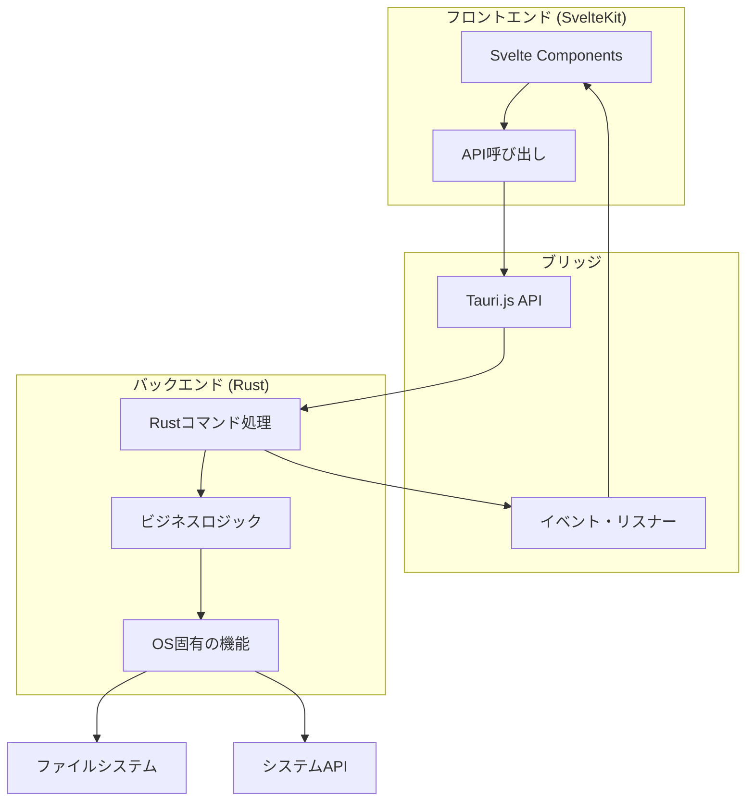
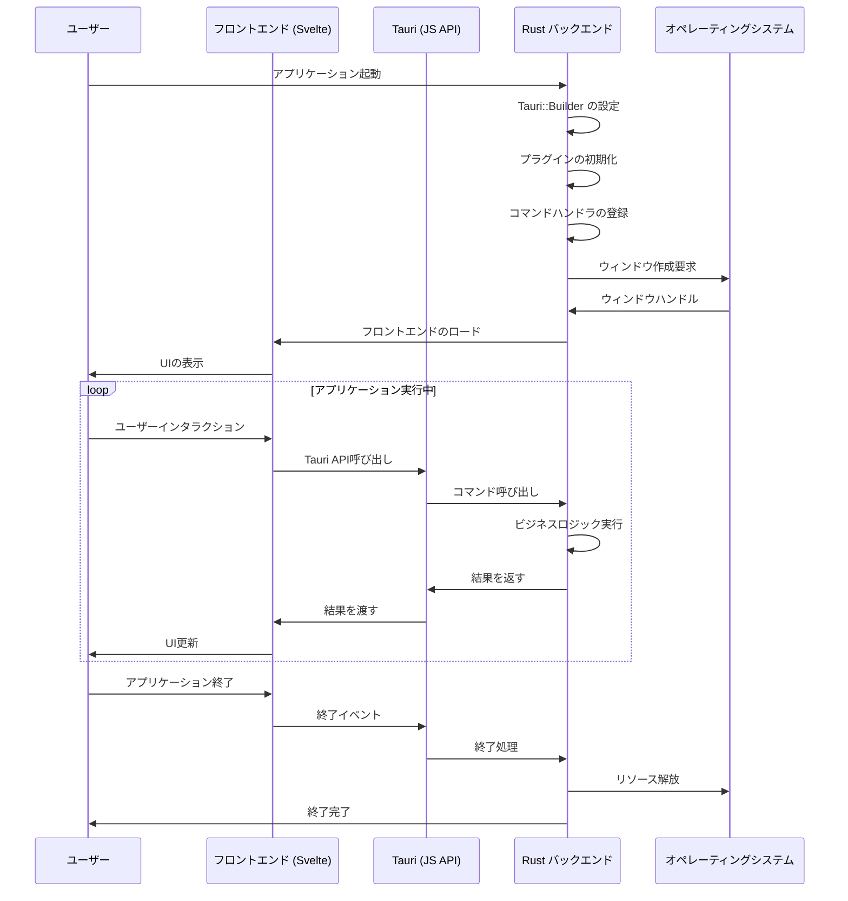

# CODLアプリケーションのアーキテクチャ

## システム構成図



## コンポーネント間の関係

CODLアプリケーションは以下の主要コンポーネントで構成されています：

1. **フロントエンド (SvelteKit + TypeScript)**
   - ユーザーインターフェースの構築と表示
   - ユーザー入力の処理
   - バックエンド機能の呼び出し

2. **ブリッジ層 (Tauri API)**
   - フロントエンドとバックエンド間の通信を管理
   - JavaScriptからRustへのコマンド送信
   - RustからJavaScriptへのイベント送信

3. **バックエンド (Rust)**
   - ビジネスロジックの実装
   - システムリソースへのアクセス
   - OS固有の機能の提供

## Tauriにおけるrustのライフサイクルと構成

### Rustコードの役割（初心者向け解説）

Tauriアプリケーションでは、Rustはアプリケーションのコアとなるバックエンド部分を担当します。RustはC++と同様の高速性を持ちながら、メモリ安全性を保証するモダンな言語です。Tauriでは以下の役割を果たします：

1. **アプリケーションのライフサイクル管理**
   - アプリの起動と終了
   - ウィンドウの生成と管理
   - イベントループの処理

2. **ネイティブ機能へのアクセス**
   - ファイルシステム操作
   - ネットワーク通信
   - OSのAPI呼び出し

3. **パフォーマンス重視の処理**
   - 計算負荷の高い処理
   - バックグラウンドタスク
   - ハードウェアリソースの効率的な利用

### Tauriアプリケーションのライフサイクル



### Rustコードの構成（src-tauri/src/)

CODLアプリケーションのRustコードは主に次のように構成されています：

#### 1. main.rs
この実際のバイナリエントリポイントです。カスタマイズの必要はほとんどなく、通常は`lib.rs`で定義されたロジックを呼び出すだけです。

```rust
// Windows でリリース時に余分なコンソールウィンドウを表示しないための設定
#![cfg_attr(not(debug_assertions), windows_subsystem = "windows")]

fn main() {
    codl_lib::run() // lib.rs に定義された run 関数を呼び出す
}
```

#### 2. lib.rs
アプリケーションの主要なロジックを含む「ライブラリ」部分です。Tauriの初期化、コマンド登録、プラグイン設定などを行います。

```rust
// greet コマンドの実装
#[tauri::command]
fn greet(name: &str) -> String {
    format!("Hello, {}! You've been greeted from Rust!", name)
}

// アプリケーションのメイン実行関数
#[cfg_attr(mobile, tauri::mobile_entry_point)]
pub fn run() {
    tauri::Builder::default()  // Tauriアプリのビルダーを作成
        .plugin(tauri_plugin_opener::init())  // URLオープナープラグインを追加
        .invoke_handler(tauri::generate_handler![greet])  // コマンドハンドラを登録
        .run(tauri::generate_context!())  // Tauriコンテキストを生成して実行
        .expect("error while running tauri application");  // エラー処理
}
```

### Tauri-Rustの重要な概念

#### 1. コマンドとハンドラ
フロントエンドからRustコードを呼び出す仕組みです。

```rust
// コマンド定義
#[tauri::command]
fn my_command(param1: &str, param2: i32) -> Result<String, String> {
    // ビジネスロジックの実装
    Ok(format!("処理結果: {}, {}", param1, param2))
}

// コマンドハンドラの登録
.invoke_handler(tauri::generate_handler![my_command, another_command])
```

##### フロントエンドからの呼び出し方
```typescript
import { invoke } from "@tauri-apps/api/core";

// Rustコマンドの呼び出し
const result = await invoke("my_command", { 
  param1: "テスト", 
  param2: 42 
});
```

#### 2. 状態管理（Tauri State）
アプリケーション内で状態を共有するための仕組みです。

```rust
use tauri::State;
use std::sync::Mutex;

// アプリケーション状態の定義
struct AppState {
    counter: Mutex<i32>,
}

// 状態を使用するコマンド
#[tauri::command]
fn increment_counter(state: State<AppState>) -> i32 {
    let mut counter = state.counter.lock().unwrap();
    *counter += 1;
    *counter
}

// 状態の初期化と登録
tauri::Builder::default()
    .manage(AppState { counter: Mutex::new(0) })
    .invoke_handler(tauri::generate_handler![increment_counter])
```

#### 3. イベントシステム
RustとJavaScript間で非同期にイベントを送受信するための仕組みです。

```rust
// Rustからイベントを発火する
#[tauri::command]
fn trigger_event(window: tauri::Window) {
    window.emit("rust-event", Some("イベントデータ")).unwrap();
}

// フロントエンド側でのイベントリスナー登録（TypeScript）
import { listen } from '@tauri-apps/api/event';

await listen('rust-event', (event) => {
  console.log('イベントを受信:', event.payload);
});
```

### メモリ管理とライフタイム

Rustの大きな特徴は所有権（Ownership）とライフタイムによるメモリ管理です。Tauriアプリケーションでもこの概念は重要です：

1. **所有権（Ownership）**：各値は一つの変数によって「所有」され、所有者がスコープを抜けると値は自動的に破棄されます。

2. **借用（Borrowing）**：値を「参照」として一時的に借用できます。これにより、値をコピーせずに使用できます。
   - 不変参照（`&T`）：読み取り専用
   - 可変参照（`&mut T`）：読み書き可能

3. **ライフタイム（Lifetime）**：参照がいつまで有効かを明示的に示す仕組みです。

```rust
// 簡易的な例（実際のTauriアプリでは異なる場合があります）
#[tauri::command]
fn process_data<'a>(data: &'a str) -> &'a str {
    // dataの一部を処理して返す
    &data[0..5]  // 最初の5文字を返す
}
```

### プラグインシステム

Tauriは機能拡張のためのプラグインシステムを提供しています：

```rust
// プラグインの初期化と登録
tauri::Builder::default()
    .plugin(tauri_plugin_opener::init())  // URLを外部ブラウザで開くプラグイン
    .plugin(some_other_plugin::init())    // 他のプラグイン
```

### エラー処理

Rustは強力なエラー処理の仕組みを持っており、Tauriでも活用できます：

```rust
// Result型を返すコマンド
#[tauri::command]
fn fallible_operation() -> Result<String, String> {
    // 何か処理を実行
    if something_went_wrong {
        Err("エラーが発生しました".into())  // エラーの場合
    } else {
        Ok("成功しました".into())  // 成功の場合
    }
}

// フロントエンドでのエラーハンドリング
try {
  const result = await invoke("fallible_operation");
  console.log("成功:", result);
} catch (error) {
  console.error("エラー:", error);
}
```

## まとめ

Tauriアプリケーションのアーキテクチャは、Webフロントエンド技術の柔軟性とRustの高性能・安全性を組み合わせたものです。フロントエンドの開発者はWebテクノロジーに集中しながら、必要に応じてRustバックエンドの機能を呼び出すことができます。Rustに詳しくない開発者でも、基本的なコマンド定義と登録の仕組みを理解すれば、徐々にRustのより高度な機能を活用していくことが可能です。
